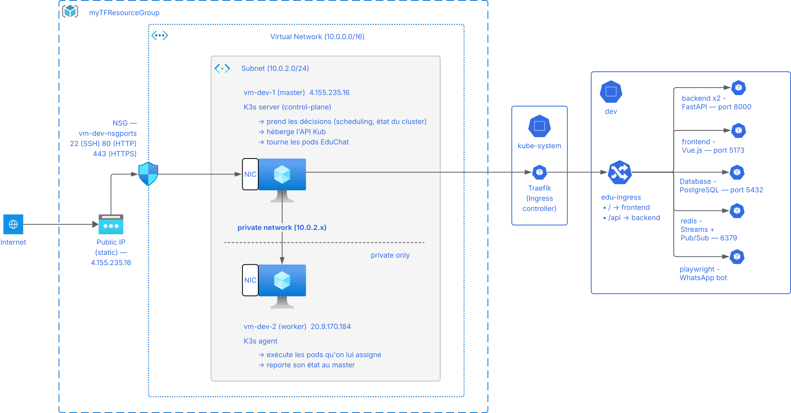

# EduChat — Azure Infrastructure

> Full-stack application deployed on Azure using Infrastructure as Code.
> Terraform provisions the cloud resources, Ansible configures the VMs and deploys the app, Helm manages the Kubernetes workloads.

---

## Architecture



```
Your Machine
  ├── terraform apply      → Azure VMs + Networking
  ├── ansible-playbook     → K3s + Helm installed on VMs
  └── helm upgrade         → EduChat running on Kubernetes
```

```
Internet
    │ :80
    ▼
Azure NSG (ports 22, 80, 443)
    │
    ▼
Traefik Ingress (K3s built-in)  ←─── vm-dev-1 (master)  4.155.235.16
    │                                 vm-dev-2 (worker)  20.9.170.184
    ├── /      → Frontend (Vue.js)   :5173
    └── /api   → Backend (FastAPI)   :8000  × 2 replicas
                     │
          ┌──────────┼──────────┐
          ▼          ▼          ▼
     PostgreSQL    Redis    Playwright
       :5432       :6379    (always-on)
```

---

## Project structure

```
.
├── azure-terraform/          # Step 1 — Cloud infrastructure
│   ├── main.tf               # Provider + Resource Group
│   ├── network.tf            # VNet, Subnet, NICs, Public IPs
│   ├── security.tf           # NSG + firewall rules
│   ├── compute.tf            # Ubuntu 22.04 VMs
│   ├── variables.tf          # Input parameters
│   └── outputs.tf            # Exported IPs and IDs
│
├── azure-ansible/
│   └── educhat/              # Step 2 — VM configuration + deployment
│       ├── kube.playbook.yaml
│       ├── ansible.cfg
│       └── inventories/
│           └── home/
│               └── hosts.yaml
│
└── azure-kubernetes/         # Step 3 — Kubernetes workloads (Helm chart)
    ├── Chart.yaml
    ├── values.yaml           # Single source of truth
    ├── values.secret.yaml    # Passwords — never committed
    └── templates/
        ├── app-config.yaml
        ├── app-secrets.yaml
        ├── deployment-*.yaml
        ├── service-*.yaml
        └── ingress.yaml
```

---

## Deployment

### Prerequisites

| Tool | Purpose |
|------|---------|
| Terraform >= 1.1.0 | Cloud provisioning |
| Ansible >= 2.12 | VM configuration |
| Helm >= 3 | Kubernetes deployment |
| Azure CLI | Authentication |
| SSH key | `~/.ssh/azure_ssh_key.pem` + `.pub` |

### Step 1 — Infrastructure

```bash
cd azure-terraform/
terraform init
terraform apply

# Copy the public IPs for the next step
terraform output vm_public_ips
```

Update `azure-ansible/educhat/inventories/home/hosts.yaml` with the new IPs.

See [README.terraform.md](README.terraform.md) for details.

### Step 2 — Configuration + Deployment

```bash
cd azure-ansible/educhat/
ansible-playbook kube.playbook.yaml
```

This installs K3s on both VMs, installs Helm on the master, copies the chart, and deploys EduChat.

To redeploy only the app (K3s already installed):
```bash
ansible-playbook kube.playbook.yaml --tags "helm,deploy"
```

See [README.ansible.md](README.ansible.md) for details.

### Step 3 — Verify

```bash
ssh -i ~/.ssh/azure_ssh_key.pem adminuser@<MASTER_IP>
sudo kubectl get all -n dev
```

All pods should show `Running`. The app is reachable at `http://<MASTER_IP>`.

See [README.kubernetes.md](README.kubernetes.md) for details.

---

## Application — EduChat

EduChat is a WhatsApp automation platform built on a microservices architecture.

| Service | Image | Role |
|---------|-------|------|
| Frontend | `ghcr.io/0xcaf3d0od/edu-frontend` | Vue.js user interface |
| Backend | `ghcr.io/0xcaf3d0od/edu-backend` | FastAPI REST API + WebSocket |
| Database | `ghcr.io/0xcaf3d0od/edu-database` | PostgreSQL |
| Cache | `redis:latest` | Streams + Pub/Sub |
| Bot | `ghcr.io/0xcaf3d0od/edu-playwright` | Playwright WhatsApp automation |

---

## Network security (NSG)

| Port | Protocol | Purpose |
|------|----------|---------|
| 22 | TCP | SSH — Ansible + admin |
| 80 | TCP | HTTP — Traefik Ingress |
| 443 | TCP | HTTPS — future SSL/TLS |

All other ports are blocked at the Azure level.

---

## Sensitive files

These files must **never be committed**:

```
azure-kubernetes/values.secret.yaml   # PostgreSQL credentials
azure-terraform/terraform.tfvars      # Azure subscription IDs
```

Both are excluded via `.gitignore`.

---

## Deployment time

| Step | Duration |
|------|----------|
| Terraform apply | ~3 min |
| Ansible playbook | ~5 min |
| Pods Running | ~2 min |
| **Total** | **~10 min** |

---

## Documentation

| File | Content |
|------|---------|
| [README.terraform.md](README.terraform.md) | Azure infrastructure — variables, commands, known issues |
| [README.ansible.md](README.ansible.md) | Playbook structure — tags, inventory, known issues |
| [README.kubernetes.md](README.kubernetes.md) | Helm chart — services, config, commands, known issues |
